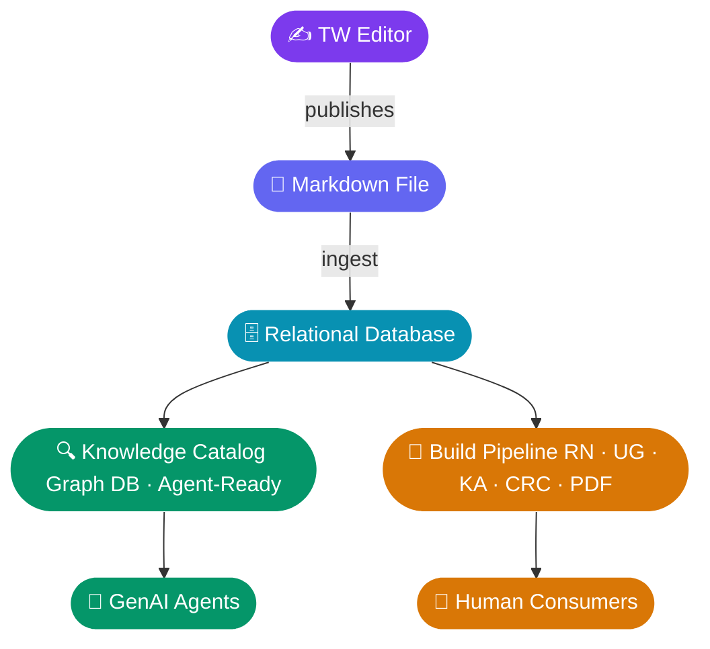

## Overview
```datacorejsx
const currentFile = app.workspace.getActiveFile();
const currentPath = currentFile ? currentFile.path.replace(/\.md$/, "") : "";

const TYPES = [
  { label: "Notes",     folder: "01-Notes",     color: "#3b82f6" },
  { label: "Goals",     folder: "02-Goals",     color: "#10b981" },
  { label: "Artifacts", folder: "03-Artifacts", color: "#f59e0b" },
  { label: "Facts",     folder: "04-Facts",     color: "#8b5cf6" },
];

return function View() {
  const counts = TYPES.map(({ folder }) => {
    const all = dc.useQuery(`@page and path("${folder}")`);
    const count = dc.useMemo(() =>
      all.filter(p => {
        const topics = p.value("topics");
        const arr = Array.isArray(topics) ? topics : (topics ? [topics] : []);
        return arr.some(t => {
          const tPath = t && (t.path || String(t));
          return tPath && tPath.replace(/\.md$/, "") === currentPath;
        });
      }).length,
    [all]);
    return count;
  });

  const total = counts.reduce((a, b) => a + b, 0);
  const maxCount = Math.max(...counts, 1);

  return (
    <div style={{ padding: "12px 0 4px 0" }}>
      {/* Bar chart */}
      <div style={{ display: "flex", flexDirection: "column", gap: "10px" }}>
        {TYPES.map(({ label, color }, i) => (
          <div key={label} style={{ display: "flex", alignItems: "center", gap: "10px" }}>
            {/* Label */}
            <div style={{ width: "72px", textAlign: "right", fontSize: "0.85em", color: "#9ca3af", flexShrink: 0 }}>
              {label}
            </div>
            {/* Bar track */}
            <div style={{ flex: 1, background: "#2a2a2a", borderRadius: "4px", height: "22px", overflow: "hidden" }}>
              <div style={{
                width: `${(counts[i] / maxCount) * 100}%`,
                minWidth: counts[i] > 0 ? "4px" : "0",
                background: color,
                height: "100%",
                borderRadius: "4px",
                transition: "width 0.4s ease",
              }} />
            </div>
            {/* Count badge */}
            <div style={{
              minWidth: "28px",
              textAlign: "center",
              fontWeight: "700",
              fontSize: "0.9em",
              color: counts[i] > 0 ? color : "#4b5563",
            }}>
              {counts[i]}
            </div>
          </div>
        ))}
      </div>

      {/* Total */}
      <div style={{ marginTop: "14px", paddingTop: "10px", borderTop: "1px solid #2a2a2a", fontSize: "0.8em", color: "#6b7280", fontStyle: "italic" }}>
        {total} item{total !== 1 ? "s" : ""} linked to this topic
      </div>
    </div>
  );
};
```





## Notes
```datacorejsx
const STATUS_ORDER = { "Needs Review":1, "Needs Transcript":2, "Prep":3, "Holding":4, "Reviewed":5 };
const PRESETS = [
  { label: "Needs Review",     color: "#eab308" },
  { label: "Needs Transcript", color: "#f97316" },
  { label: "Prep",             color: "#8b5cf6" },
  { label: "Holding",          color: "#3b82f6" },
  { label: "Reviewed",         color: "#9ca3af" },
  { label: "All",              color: "#6b7280" },
];
const STATUS_OPTIONS = ["", "Needs Review", "Needs Transcript", "Prep", "Holding", "Reviewed"];
const STATUS_COLORS = {
  "Needs Review":    "#eab308",
  "Needs Transcript":"#f97316",
  "Prep":            "#8b5cf6",
  "Holding":         "#3b82f6",
  "Reviewed":        "#9ca3af",
};
const PAGE_SIZE = 10;

const currentFile = app.workspace.getActiveFile();
const currentPath = currentFile ? currentFile.path.replace(/\.md$/, "") : "";

return function View() {
  const [activePreset, setActivePreset] = dc.useState(5);
  const [currentPage, setCurrentPage] = dc.useState(0);
  const [filter, setFilter] = dc.useState("");
  const [noteName, setNoteName] = dc.useState("");

  const handleCreateNote = async () => {
    const name = noteName.trim();
    if (!name) { new Notice("Enter a note name first"); return; }
    const today = new Date().toISOString().slice(0, 10);
    const filePath = `01-Notes/${today} - ${name}.md`;
    const content = [
      "---", "type: note",
      `created_date: '${today}'`,
      "notes_status: Needs Review",
      "meta: []", "topics:",
      `  - "[[${currentPath}]]"`,
      "entities: []",
      "---", "", ""
    ].join("\n");
    try {
      const newFile = await app.vault.create(filePath, content);
      const leaf = app.workspace.getLeaf("tab");
      await leaf.openFile(newFile);
      setNoteName("");
      new Notice(`✓ Created: ${name}`);
    } catch(e) { new Notice(`Error: ${e.message}`); }
  };

  const allNotes = dc.useQuery('@page and path("01-Notes")');

  const topicNotes = dc.useMemo(() => {
    return allNotes.filter(p => {
      const topics = p.value("topics");
      const arr = Array.isArray(topics) ? topics : (topics ? [topics] : []);
      return arr.some(t => {
        const tPath = t && (t.path || String(t));
        return tPath && tPath.replace(/\.md$/, "") === currentPath;
      });
    });
  }, [allNotes]);

  const filtered = dc.useMemo(() => {
    const q = filter.toLowerCase();
    const presetLabel = PRESETS[activePreset].label;
    return topicNotes
      .filter(p => {
        const s = p.value("notes_status");
        const status = Array.isArray(s) ? s[0] : s;
        const matchesPreset = presetLabel === "All" || status === presetLabel;
        return matchesPreset && p.$name.toLowerCase().includes(q);
      })
      .sort((a, b) => {
        const aS = a.value("notes_status"); const bS = b.value("notes_status");
        const aO = STATUS_ORDER[Array.isArray(aS) ? aS[0] : aS] ?? 99;
        const bO = STATUS_ORDER[Array.isArray(bS) ? bS[0] : bS] ?? 99;
        if (aO !== bO) return aO - bO;
        const normDate = (d) => !d ? "" : typeof d.toISO === "function" ? d.toISO() : String(d).substring(0, 10);
        const aN = normDate(a.value("created_date"));
        const bN = normDate(b.value("created_date"));
        if (aN && bN) return bN > aN ? 1 : -1;
        if (aN) return -1;
        if (bN) return 1;
        return 0;
      });
  }, [topicNotes, activePreset, filter]);

  const totalPages = Math.ceil(filtered.length / PAGE_SIZE);
  const pageResults = filtered.slice(currentPage * PAGE_SIZE, (currentPage + 1) * PAGE_SIZE);

  const handleStatusChange = async (filePath, newStatus) => {
    const tfile = app.vault.getAbstractFileByPath(filePath);
    if (tfile) {
      await app.fileManager.processFrontMatter(tfile, fm => {
        if (newStatus) fm.notes_status = newStatus;
        else delete fm.notes_status;
      });
    }
  };

  return (
    <div>
      {/* New Note */}
      <div style={{ display:"flex", flexDirection:"column", gap:"6px", marginBottom:"14px", maxWidth:"400px" }}>
        <input type="text" placeholder="Note name…" value={noteName}
          onChange={e => setNoteName(e.target.value)}
          onKeyDown={e => { if (e.key === "Enter") handleCreateNote(); }}
          style={{ width:"100%", padding:"6px 10px", borderRadius:"4px", border:"1px solid #3b3b3b", background:"#1e1e1e", color:"inherit", boxSizing:"border-box" }}
        />
        <button onClick={handleCreateNote}
          style={{ padding:"6px 14px", background:"#2563eb", color:"white", border:"none", borderRadius:"4px", cursor:"pointer", fontWeight:"600", width:"100%" }}
        >+ New Note</button>
      </div>

      {/* Preset buttons */}
      <div style={{ display:"flex", flexWrap:"wrap", gap:"6px", marginBottom:"10px" }}>
        {PRESETS.map((preset, i) => (
          <button key={preset.label}
            onClick={() => { setActivePreset(i); setCurrentPage(0); }}
            style={i === activePreset
              ? { padding:"4px 12px", cursor:"pointer", background:preset.color, color:"white", border:`2px solid ${preset.color}`, borderRadius:"4px", fontWeight:"600" }
              : { padding:"4px 12px", cursor:"pointer", background:"transparent", border:`1px solid ${preset.color}`, color:preset.color, borderRadius:"4px" }
            }
          >{preset.label}</button>
        ))}
      </div>

      {/* Search */}
      <input type="text" placeholder="Filter by note name…" value={filter}
        onChange={e => { setFilter(e.target.value); setCurrentPage(0); }}
        style={{ width:"100%", padding:"6px 10px", marginBottom:"10px" }}
      />

      {/* Pagination */}
      {filtered.length > PAGE_SIZE && (
        <div style={{ marginBottom:"10px", textAlign:"center" }}>
          <span style={{ opacity:0.7, marginRight:"1em" }}>Page {currentPage+1} of {totalPages} ({filtered.length} total)</span>
          {currentPage > 0 && <button onClick={() => setCurrentPage(p => p-1)} style={{ padding:"4px 12px", marginRight:"8px", cursor:"pointer" }}>← Previous</button>}
          {currentPage < totalPages-1 && <button onClick={() => setCurrentPage(p => p+1)} style={{ padding:"4px 12px", cursor:"pointer" }}>Next →</button>}
        </div>
      )}

      {/* Table */}
      {filtered.length > 0 && (
        <table className="dataview table-view-table">
          <thead><tr><th>Name</th><th>Status</th><th>Entities</th><th>Created</th></tr></thead>
          <tbody>
            {pageResults.map(p => {
              const s = p.value("notes_status");
              const status = Array.isArray(s) ? s[0] : (s || "");
              const color = STATUS_COLORS[status] || "#6b7280";
              const entities = p.value("entities");
              const entArr = entities ? (Array.isArray(entities) ? entities : [entities]).filter(Boolean) : [];
              const cd = p.value("created_date");
              const dateStr = cd ? (typeof cd.toFormat==="function" ? cd.toFormat("yyyy-MM-dd") : String(cd).substring(0,10)) : "—";
              const displayName = /^\d{4}-\d{2}-\d{2} - /.test(p.$name)
                ? "…" + p.$name.replace(/^\d{4}-\d{2}-\d{2} - /, "")
                : p.$name;
              return (
                <tr key={p.$path}>
                  <td><a href={p.$path} className="internal-link" data-href={p.$path}>{displayName}</a></td>
                  <td>
                    <select value={status} onChange={e => handleStatusChange(p.$path, e.target.value)}
                      style={{ background:"#1e1e1e", border:`1px solid ${color}`, color:color, padding:"3px 8px", borderRadius:"4px", fontSize:"0.85em", fontWeight:"500", cursor:"pointer" }}>
                      {STATUS_OPTIONS.map(opt => (
                        <option key={opt} value={opt} style={{ background:"#1e1e1e", color:STATUS_COLORS[opt]||"#9ca3af" }}>{opt||"—"}</option>
                      ))}
                    </select>
                  </td>
                  <td style={{ fontSize:"0.85em" }}>
                    {entArr.length > 0
                      ? entArr.map((e, i) => {
                          const path = e.path || e;
                          const name = String(path).split('/').pop().replace(/\.md$/,'');
                          return <span key={i}>{i>0 && ", "}<a href={path} className="internal-link" data-href={path} style={{ color:"#9ca3af" }}>{name}</a></span>;
                        })
                      : "—"}
                  </td>
                  <td style={{ fontSize:"0.85em", fontStyle:"italic" }}>{dateStr}</td>
                </tr>
              );
            })}
          </tbody>
        </table>
      )}

      {filtered.length === 0 && (
        <div style={{ opacity:0.5, fontStyle:"italic", padding:"8px 0" }}>No notes for this topic yet.</div>
      )}

      {/* Footer */}
      <div style={{ marginTop:"20px", paddingTop:"10px", borderTop:"1px solid #3b3b3b", fontSize:"0.8em", color:"#6b7280", fontStyle:"italic" }}>
        {filtered.length} note{filtered.length!==1?"s":""} shown | {topicNotes.length} total for this topic
      </div>
    </div>
  );
};
```

## Goals
```datacorejsx
const PAGE_SIZE = 5;
const currentFile = app.workspace.getActiveFile();
const currentPath = currentFile ? currentFile.path.replace(/\.md$/, "") : "";

return function View() {
  const [currentPage, setCurrentPage] = dc.useState(0);

  const allGoals = dc.useQuery('@page and path("02-Goals")');

  const topicGoals = dc.useMemo(() => {
    return allGoals
      .filter(p => {
        const topics = p.value("topics");
        const arr = Array.isArray(topics) ? topics : (topics ? [topics] : []);
        return arr.some(t => {
          const tPath = t && (t.path || String(t));
          return tPath && tPath.replace(/\.md$/, "") === currentPath;
        });
      })
      .sort((a, b) => {
        const normDate = (d) => !d ? "" : typeof d.toISO === "function" ? d.toISO() : String(d).substring(0, 10);
        const aN = normDate(a.value("created_date"));
        const bN = normDate(b.value("created_date"));
        if (aN && bN) return bN > aN ? 1 : -1;
        if (aN) return -1;
        if (bN) return 1;
        return 0;
      });
  }, [allGoals]);

  const totalPages = Math.ceil(topicGoals.length / PAGE_SIZE);
  const pageResults = topicGoals.slice(currentPage * PAGE_SIZE, (currentPage + 1) * PAGE_SIZE);

  return (
    <div>
      {topicGoals.length > 0 ? (
        <table className="dataview table-view-table">
          <thead><tr><th>Name</th><th>Created</th></tr></thead>
          <tbody>
            {pageResults.map(p => {
              const cd = p.value("created_date");
              const dateStr = cd ? (typeof cd.toFormat==="function" ? cd.toFormat("yyyy-MM-dd") : String(cd).substring(0,10)) : "—";
              return (
                <tr key={p.$path}>
                  <td><a href={p.$path} className="internal-link" data-href={p.$path}>{p.$name}</a></td>
                  <td style={{ fontSize:"0.85em", fontStyle:"italic" }}>{dateStr}</td>
                </tr>
              );
            })}
          </tbody>
        </table>
      ) : (
        <div style={{ opacity:0.5, fontStyle:"italic", padding:"8px 0" }}>No goals for this topic yet.</div>
      )}

      {topicGoals.length > PAGE_SIZE && (
        <div style={{ marginTop:"8px", textAlign:"center" }}>
          <span style={{ opacity:0.7, marginRight:"1em" }}>Page {currentPage+1} of {totalPages}</span>
          {currentPage > 0 && <button onClick={() => setCurrentPage(p => p-1)} style={{ padding:"4px 12px", marginRight:"8px", cursor:"pointer" }}>← Previous</button>}
          {currentPage < totalPages-1 && <button onClick={() => setCurrentPage(p => p+1)} style={{ padding:"4px 12px", cursor:"pointer" }}>Next →</button>}
        </div>
      )}

      <div style={{ marginTop:"6px", fontSize:"0.8em", color:"#6b7280", fontStyle:"italic" }}>
        {topicGoals.length} goal{topicGoals.length!==1?"s":""} total
      </div>
    </div>
  );
};
```

## Artifacts
```datacorejsx
const PAGE_SIZE = 5;
const currentFile = app.workspace.getActiveFile();
const currentPath = currentFile ? currentFile.path.replace(/\.md$/, "") : "";

return function View() {
  const [currentPage, setCurrentPage] = dc.useState(0);

  const allArtifacts = dc.useQuery('@page and path("03-Artifacts")');

  const topicArtifacts = dc.useMemo(() => {
    return allArtifacts
      .filter(p => {
        const topics = p.value("topics");
        const arr = Array.isArray(topics) ? topics : (topics ? [topics] : []);
        return arr.some(t => {
          const tPath = t && (t.path || String(t));
          return tPath && tPath.replace(/\.md$/, "") === currentPath;
        });
      })
      .sort((a, b) => {
        const normDate = (d) => !d ? "" : typeof d.toISO === "function" ? d.toISO() : String(d).substring(0, 10);
        const aN = normDate(a.value("created_date"));
        const bN = normDate(b.value("created_date"));
        if (aN && bN) return bN > aN ? 1 : -1;
        if (aN) return -1;
        if (bN) return 1;
        return 0;
      });
  }, [allArtifacts]);

  const totalPages = Math.ceil(topicArtifacts.length / PAGE_SIZE);
  const pageResults = topicArtifacts.slice(currentPage * PAGE_SIZE, (currentPage + 1) * PAGE_SIZE);

  return (
    <div>
      {topicArtifacts.length > 0 ? (
        <table className="dataview table-view-table">
          <thead><tr><th>Name</th><th>Created</th></tr></thead>
          <tbody>
            {pageResults.map(p => {
              const cd = p.value("created_date");
              const dateStr = cd ? (typeof cd.toFormat==="function" ? cd.toFormat("yyyy-MM-dd") : String(cd).substring(0,10)) : "—";
              return (
                <tr key={p.$path}>
                  <td><a href={p.$path} className="internal-link" data-href={p.$path}>{p.$name}</a></td>
                  <td style={{ fontSize:"0.85em", fontStyle:"italic" }}>{dateStr}</td>
                </tr>
              );
            })}
          </tbody>
        </table>
      ) : (
        <div style={{ opacity:0.5, fontStyle:"italic", padding:"8px 0" }}>No artifacts for this topic yet.</div>
      )}

      {topicArtifacts.length > PAGE_SIZE && (
        <div style={{ marginTop:"8px", textAlign:"center" }}>
          <span style={{ opacity:0.7, marginRight:"1em" }}>Page {currentPage+1} of {totalPages}</span>
          {currentPage > 0 && <button onClick={() => setCurrentPage(p => p-1)} style={{ padding:"4px 12px", marginRight:"8px", cursor:"pointer" }}>← Previous</button>}
          {currentPage < totalPages-1 && <button onClick={() => setCurrentPage(p => p+1)} style={{ padding:"4px 12px", cursor:"pointer" }}>Next →</button>}
        </div>
      )}

      <div style={{ marginTop:"6px", fontSize:"0.8em", color:"#6b7280", fontStyle:"italic" }}>
        {topicArtifacts.length} artifact{topicArtifacts.length!==1?"s":""} total
      </div>
    </div>
  );
};
```

## Facts
```datacorejsx
const PAGE_SIZE = 5;
const currentFile = app.workspace.getActiveFile();
const currentPath = currentFile ? currentFile.path.replace(/\.md$/, "") : "";

return function View() {
  const [currentPage, setCurrentPage] = dc.useState(0);

  const allFacts = dc.useQuery('@page and path("04-Facts")');

  const topicFacts = dc.useMemo(() => {
    return allFacts
      .filter(p => {
        const topics = p.value("topics");
        const arr = Array.isArray(topics) ? topics : (topics ? [topics] : []);
        return arr.some(t => {
          const tPath = t && (t.path || String(t));
          return tPath && tPath.replace(/\.md$/, "") === currentPath;
        });
      })
      .sort((a, b) => {
        const normDate = (d) => !d ? "" : typeof d.toISO === "function" ? d.toISO() : String(d).substring(0, 10);
        const aN = normDate(a.value("created_date"));
        const bN = normDate(b.value("created_date"));
        if (aN && bN) return bN > aN ? 1 : -1;
        if (aN) return -1;
        if (bN) return 1;
        return 0;
      });
  }, [allFacts]);

  const totalPages = Math.ceil(topicFacts.length / PAGE_SIZE);
  const pageResults = topicFacts.slice(currentPage * PAGE_SIZE, (currentPage + 1) * PAGE_SIZE);

  return (
    <div>
      {topicFacts.length > 0 ? (
        <table className="dataview table-view-table">
          <thead><tr><th>Name</th><th>Created</th></tr></thead>
          <tbody>
            {pageResults.map(p => {
              const cd = p.value("created_date");
              const dateStr = cd ? (typeof cd.toFormat==="function" ? cd.toFormat("yyyy-MM-dd") : String(cd).substring(0,10)) : "—";
              return (
                <tr key={p.$path}>
                  <td><a href={p.$path} className="internal-link" data-href={p.$path}>{p.$name}</a></td>
                  <td style={{ fontSize:"0.85em", fontStyle:"italic" }}>{dateStr}</td>
                </tr>
              );
            })}
          </tbody>
        </table>
      ) : (
        <div style={{ opacity:0.5, fontStyle:"italic", padding:"8px 0" }}>No facts for this topic yet.</div>
      )}

      {topicFacts.length > PAGE_SIZE && (
        <div style={{ marginTop:"8px", textAlign:"center" }}>
          <span style={{ opacity:0.7, marginRight:"1em" }}>Page {currentPage+1} of {totalPages}</span>
          {currentPage > 0 && <button onClick={() => setCurrentPage(p => p-1)} style={{ padding:"4px 12px", marginRight:"8px", cursor:"pointer" }}>← Previous</button>}
          {currentPage < totalPages-1 && <button onClick={() => setCurrentPage(p => p+1)} style={{ padding:"4px 12px", cursor:"pointer" }}>Next →</button>}
        </div>
      )}

      <div style={{ marginTop:"6px", fontSize:"0.8em", color:"#6b7280", fontStyle:"italic" }}>
        {topicFacts.length} fact{topicFacts.length!==1?"s":""} total
      </div>
    </div>
  );
};
```


![[Pasted image 20260602091451.png]]

## Work Streams
- `Chat v1 (AS) w/ SF
- Voice Update v2 (AS)
- `1st Responder
    - part of hybrid UI
    - need plan
    - engineering CC
- "Knowledge" Data Pipeline
    - Markdown → Relational DB → Graph DB
- TW Markdown Editor
- Legacy TW Build
    - Relational DB →
        - PDF (RN, KA, …)
        - CRC New
- Chat + Voice use Graph DB
- TW  Ops process for content
    - external to TW: EVV
- Chat + Soln Integration
	- API integration support specific application use-cases
- Amazon Connect


### Idea
* **Customers Call to get an Update on a Case** - many calls are follow ups on existing cases, implying that an API dip to let GenAI provide this will remove a big chunk of calls coming in to support. 

