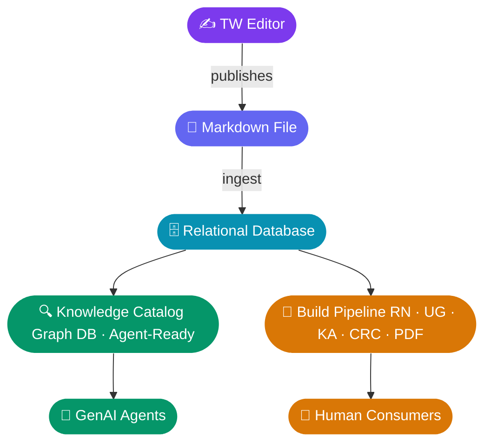

I want this note to represent an overview that I can hand. To my Enterprise architects to help me design. The right way when the technical writing team. To enrich the content. With respect to the information architecture, data taxonomy. To tune a rag to support generative AI. With respect to accuracy tuning. The use case here is that what I want to do is enrich the markdown files of the technical writing team is building. To include specific metadata used for generative AI tuning. Add a team called Problem Management. Who represent the tuning aspect of these genetic AI models around content? Currently they are identifying gaps in content. When the gap is identified. They place their work item on the back of the United teams backlog that represents a gap in knowledge potential writing team to fill that gap by writing articles. We're going to automatically adjust it with the. A GCP storage bucket in the form of Jason and that is where I generated AI for camera experience. Use it as its knowledge store. As we enhance this based on the overall project. This topic covers. We are moving. Technical writing team to offer a markdown. And I want to create a new requirement for this work to enrich the markdown. With formalizing information architecture and building, that's.

---

# Pre-Read: Information Architecture & Data Taxonomy for GenAI Content Tuning

**To:** Vivek Pissay, Balki Nakshatrala, Abhirup Dash
**From:** Ryan Dunn
**Date:** June 1, 2026

---

## Overview

As the Technical Writing team moves to markdown, we need to define the metadata schema and taxonomy for those files. The markdown is the data source. It feeds a relational database, which feeds the knowledge graph, which drives AI containment. The design decision lives at the source — the markdown.

I need your direction on how to structure that metadata to maximize what the knowledge graph can do with it.

---

## The Content Pipeline

The diagram below shows how content flows. A TW editor publishes a markdown file. That file is ingested into a relational database, which feeds two downstream paths:

1. **Knowledge Catalog / Graph DB** → CCAI and RAG agents
2. **Build Pipeline** → static artifacts (Release Notes, User Guides, Knowledge Articles, CRC site, PDFs)

The markdown file is the common source for both paths. The question is: what metadata and structure should live in those files to support the GenAI path, and how does that interact with the build path?

---

## Additional Context: Problem Management

**Problem Management** owns the research and tuning from a day to day operational view point. They identify gaps in what CCAI can answer, place work items on the TW backlog, and TW fills those gaps with new or updated articles. That feedback loop is worth keeping in mind when thinking about how metadata should be structured.

---

## Secondary Topic: Legal / Contractual Vocabulary

Lower priority, but I want to flag it while we're talking about taxonomy. We manage contracts in Onspring and there's an inconsistency problem with contractual vocabulary — terms like "solution" don't mean the same thing across contracts, and that bleeds into documentation. David Stevens has brought this to me and would like some alignment, but this is not a new term requirement. It's not the focus of this meeting, but it may be relevant context if we're thinking about a controlled vocabulary.

---

## Discussion

I'd like your input on:

- How should markdown files be enriched with metadata to support RAG / AI tuning?
- What does the right information architecture look like for content that serves both an AI and a human build pipeline?
- Are there data taxonomy standards or patterns you'd recommend for this kind of setup?
- Anything in this pipeline you'd design differently?

