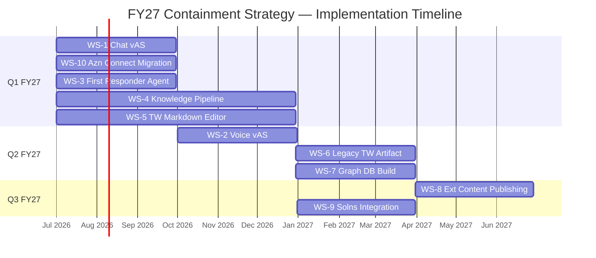

![[Pasted image 20260603094431.png]]

## Implementation Timeline

---

## WS-1 — Chat v1 (Agent Studio)

`**Priority:** 1

**Summary:** Reimplementation of the GECX chat channel using Agent Studio technology. Integrates with Salesforce via API to read and write the Case object. Delivered as an HTML widget embedded on the Customer Resource Center (CRC) website.

**Scope:**
- Rebuild GECX chat on Agent Studio platform
- Salesforce Case object read/write via API integration
- HTML widget deployment on CRC

**Dependencies:** May inform or be unified with WS-2 — Google has indicated Agent Studio can support a single design for both voice and chat.

**Lead:**  Michael Proffer

**Status:** Not Started

---

## WS-2 — Voice Update v2 (Agent Studio)

`**Priority:** 4

**Summary:** Uplifts the existing GECX voice channel from Dialogflow to Agent Studio. Delivers a more lifelike conversational experience including customer interrupt capability. Google has indicated Agent Studio may support a single unified design covering both voice and chat.

**Scope:**
- Migrate GECX voice from Dialogflow to Agent Studio
- Implement customer interrupt capability
- Evaluate unified voice + chat design with Google

**Dependencies:** May be consumed by or unified with WS-1.

**Lead:** Michael Proffer

**Status:** Not Started

---

## WS-3 — First Responder Agent

`**Priority:** 2

**Summary:** An in-house GenAI agent built on the backend — not customer-facing. Leverages the existing knowledge article base to auto-respond to Salesforce support cases. Targets the large backlog of support cases the human support team cannot address effectively.

**Scope:**
- GenAI backend agent integrated with Salesforce case queue
- Automated response drafting using existing knowledge articles
- Backlog reduction for human support team

**Dependencies:** Informed by WS-4 (Knowledge Pipeline) as knowledge base matures.

**Lead:** Jared Weinzerl

**Status:** Not Started

---

## WS-4 — Knowledge Pipeline

`**Priority:** 6

**Summary:** End-to-end data pipeline that moves content from Markdown files authored by the TW team through a relational database (with metadata enrichment) into a graph database. The relational DB serves dual purposes: feeding the legacy TW artifact build and feeding the graph DB for GenAI. The graph DB becomes the authoritative knowledge source for voice and chat GenAI models.

**Scope:**
- Markdown file ingestion from TW authoring output
- Relational DB build with metadata enrichment
- Graph DB population and maintenance
- Dual output path: legacy artifact build (WS-6) and GenAI knowledge source (WS-7)

**Dependencies:** Feeds WS-3, WS-6, and WS-7. Downstream of WS-5.

**Lead:** Abhriup Dash

**Status:** Not Started

---

## WS-5 — TW Markdown Editor

`**Priority:** 5

**Summary:** Replaces MadCap Flare as the technical writing team's primary authoring tool. Output is Markdown format enriched with metadata for information architecture and data taxonomy. Integrates existing TW agents (GitHub release notes, JIRA work items) to produce draft documentation while preserving existing TW operational workflows.

**Scope:**
- MadCap Flare replacement with Markdown-based editor
- Metadata enrichment for IA and data taxonomy
- Integration with existing TW agents (GitHub release notes, JIRA work items)
- Draft documentation generation from integrated sources

**Dependencies:** Output feeds WS-4 (Knowledge Pipeline).

**Lead:** Jason Nicol

**Status:** Not Started

---

## WS-6 — Legacy TW Artifact Build

`**Priority:** 7

**Summary:** Formalizes the extraction process from the relational database to publish legacy documentation deliverables. Outputs include PDFs (Release Notes, Knowledge Articles, User Guides) and HTML content on CRC. Maintains parity with today's deliverable formats — apples to apples.

**Scope:**
- Relational DB to PDF pipeline (Release Notes, Knowledge Articles, User Guides)
- HTML publishing to CRC
- Format parity with current TW deliverables

**Dependencies:** Depends on WS-4 (Knowledge Pipeline) for relational DB source.

**Lead:** Abhirup Dash

**Status:** Not Started

---

## WS-7 — Voice + Chat — Graph DB Migration

`**Priority:** 8

**Summary:** Matures the GenAI knowledge architecture by migrating from the current state (JSON blobs in GCP buckets) to the graph database. Connects both the voice and chat channels to the graph DB as their authoritative knowledge source. Replaces the current JSON extract process.

**Scope:**
- Migrate voice and chat knowledge source from JSON/GCP buckets to graph DB
- Connect GECX voice and chat channels to graph DB
- Decommission current JSON extract process

**Dependencies:** Depends on WS-4 (Knowledge Pipeline) for graph DB readiness. Affects WS-1 and WS-2.

**Lead:** Vivek Pissay, Abhriup Dash to support

**Status:** Not Started

---

## WS-8 — External Content Publishing Process (Ops)

`**Priority:** 10

**Summary:** An operational process that allows non-TW staff to formally submit and publish content for GenAI models. Formalizes a safe, secure, and governed path for solution teams and other staff to contribute to the knowledge graph. Content flows through the TW Markdown publishing process into the graph DB.

**Scope:**
- Submission and review workflow for non-TW content contributors
- Governance and approval gates
- Integration into TW Markdown publishing pipeline and graph DB

**Dependencies:** Depends on WS-4 (Knowledge Pipeline) and WS-5 (TW Markdown Editor) for the publishing path.

**Lead:** Jason Nicol

**Status:** Not Started

---

## WS-9 — Chat + Voice — Solutions Integration

`**Priority:** 9

**Summary:** A solution-specific API integration path for the GenAI chat and voice channels. Solutions expose API endpoints that customers can act on via GenAI chat prompts. The chat widget is deployed inside solution applications.

**Scope:**
- API endpoint exposure by solution teams
- Customer-facing action via GenAI chat prompt
- Chat widget deployment within solution applications
- Priority candidates: Home Health (highest impact), Connected Networks, Personal Care (noted as always the big first step)

**Dependencies:** Depends on WS-1 (Chat v1) and WS-2 (Voice Update v2) being in place.

**Lead:** Ryan Dunn, Abhirup Dash

---

## WS-10 — Amazon Connect Migration

`**Priority:** 3

**Summary:** Migrates all WellSky telephony endpoints from Amazon Connect to the GECX voice channel. Consolidates all public phone lines onto the unified GECX platform. Straightforward endpoint migration with no architectural change required.

**Scope:**
- Inventory of all Amazon Connect telephony endpoints
- Endpoint-by-endpoint migration to GECX voice channel
- Decommission of Amazon Connect footprint

**Dependencies:** Depends on WS-2 (Voice Update v2) being stable.

**Lead:** Michael Proffer
