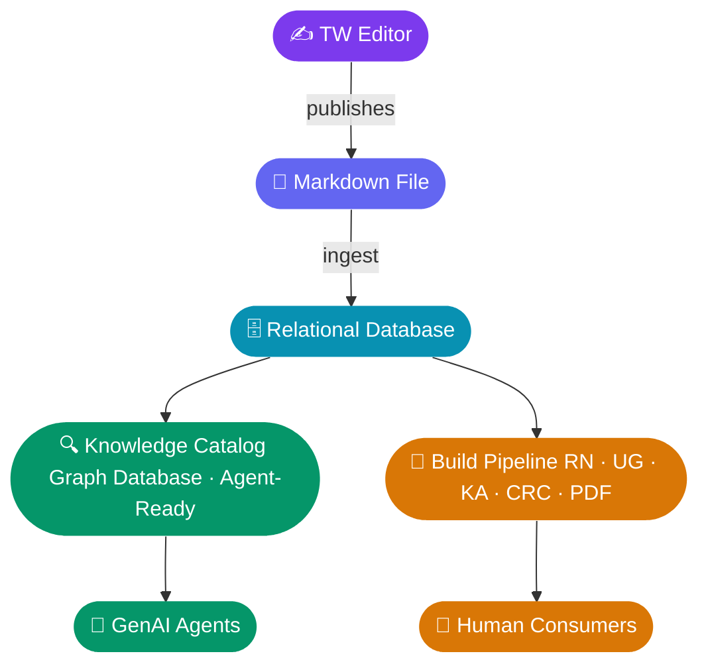

# TOPIC 1 - Knowledge Data Infrastructure 

> *Created: 2026-04-23T21:57:00.000Z*

# Topic Overview
This topic defines the enterprise knowledge data architecture for CE - the intentional, GenAI-first design for how CE knowledge is authored, stored, governed, and consumed. It establishes CE as a strategic data owner within WellSky's broader GenAI and enterprise data strategy.
This topic sits under Pillar 1 - Enterprise Knowledge Data Architecture.
---
# Architecture Direction
The knowledge architecture has been formally defined as follows:
> Key principle: The in-house Markdown editor is the authoring system of record. The Relational DB is the unified structured representation downstream of the Markdown editor - every consumer (human or agent) reads from the Relational DB (directly or via Knowledge Catalog), never from the authoring tool. This single canonical structured layer eliminates parallel pipelines.
---
# Why Knowledge Catalog
Google's Knowledge Catalog is a managed semantic layer purpose-built to feed GenAI agents:
- Semantic curation: synthesizes business context from schemas, query logs, and structured content into a unified glossary
- Multimodal: can read both structured data and unstructured sources (PDFs, wikis, design docs)
- Agent-ready retrieval: exposes context to agents via semantic search, Context APIs, and MCP tools
- Governance built-in: policy-based quality, lineage, and access control are part of the platform - not bolted on
The capability we are committing to is a managed semantic layer for agent-ready content. Knowledge Catalog is today's product expression of that capability - but the architecture must be designed against the capability, not the brand. Google has rebranded this product once (Dataplex → Knowledge Catalog) and may evolve it again.
---
# Data Flow

Single source flow. No parallel pipelines. Markdown editor is editorial; Relational DB is canonical; Knowledge Catalog is for agents; build pipeline is for humans.

# Downstream Consumers
---
# Data Governance & RACI Requirements
> ⚠️ Prerequisite to execution: A formal RACI defining business ownership vs. IT stewardship must be established before pipeline work begins.
- IT (GenAI CoE + Engineering Overall): Builds and maintains the Markdown Editor → Relational DB → Knowledge Catalog pipeline; manages service accounts, IAM scope, and Catalog configuration
- Business (Client Experience + TW team): Owns content quality in the Markdown editor, publishing standards, and editorial workflow
- Service account management: GCP service accounts and Knowledge Catalog principal scoping must be formally defined; risk of IT becoming de facto admins of business content remains the primary governance concern
---
# Architectural Considerations
- The Markdown editor outputs structured markdown files. Engineering must treat the Markdown Editor → Relational DB ETL as a real data engineering problem (schema design, change-data-capture, error handling), not a one-time export.
- The Relational DB does double duty. It is both the ingestion source for Knowledge Catalog and the serving source for human-facing surfaces. The build pipeline pattern (Relational DB → static site/PDF generators) handles production traffic and caching cleanly.

---
# Key Notes by IT Group
---
# Decision Needed
- Align on the Markdown Editor → Relational DB → Knowledge Catalog architecture, assign a pipeline owner, confirm the RACI process, and set a 60-day first-delivery target for the structured sync layer.
- The data structure and flow defined here will drive TW Publishing Workflow and Tooling. 
---
# Google Next Pivot
> This topic is the Google Next pivot. The April 2026 announcement of Knowledge Catalog (formerly Dataplex) provides the managed semantic layer this architecture was previously going to require us to build. The pivot is to adopt Knowledge Catalog as the GenAI-grounding layer rather than building or assembling equivalent functionality from BigQuery + custom retrieval. The capability commitment (managed semantic layer + agent-ready governance) survives any future Google rebrand.

